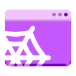

<br />
<div align="center">
  <a href="#">
    
  </a>

  <h1 align="center">Spider</h1>

  <h3 align="center">
    Install web apps with ease
  </h3>

  
  <i>Special thanks to <a href="https://github.com/oiimrosabel">oiimrosabel</a> for the icon!</i>
</div>


## Features ✨

- [x] **Sandboxed**: Each app has an entirely separate instance of the WebKit browser
- [x] **Adaptive Window Styling**: Each app's titlebar adapts to it's [theme color](https://developer.mozilla.org/en-US/docs/Web/HTML/Element/meta/name/theme-color)
- [x] **High quality favicons**: Scrapes websites for a high quality favicon to use

## Planned ✔️

- [ ] Website permissions
- [ ] Get website data via webview
- [ ] Option to autostart and run apps in background
- [ ] Domain restriction
- [ ] More keybinds in web app
- [ ] A better name and app icon
- [ ] HTTP Proxy settings
- [ ] Handle pop ups

> ✨ Please let me know if you'd like any more features! ✨

> DO NOT BE AFRIAD TO SUBMIT BUGS!
> I know there is lots of web functionality that you might be missing

## Building 🛠️

### GNOME Builder 🏗️

This project is easily buildable with [GNOME Builder](https://apps.gnome.org/Builder/).

### Meson 🖥️

To setup meson, run

```
meson setup target -Dbuildtype=debug --prefix="$HOME/.local"
```

Then to compile, run

```
ninja install -C target/
```

## Thanks to these awesome people and projects! ❤️

- [oiimrosabel](https://github.com/oiimrosabel) (the awesome icon!)
- [jbenner-radham/rust-gtk4-css-styling](https://github.com/jbenner-radham/rust-gtk4-css-styling) (per-theme custom css)
- [gtk-rs/gtk4-rs](https://github.com/gtk-rs/gtk4-rs) (obviously lol)
- [eyekay/webapps](https://codeberg.org/eyekay/webapps) (the idea)
- [bilelmoussaoui/ashpd](https://github.com/bilelmoussaoui/ashpd) (the library and the quality examples)
